# ZJU-blockchain-course-2023-BorrowYourCar

## 如何运行

1. 在本地启动ganache应用。

2. 在 `./contracts` 中安装需要的依赖，运行如下的命令：
    ```bash
    $ npm install
    ```

3. 在 `./contracts` 中编译合约，运行如下的命令：
    ```bash
    $ npx hardhat compile
    ```

4. 在 `./contracts` 中部署，在`./contracts/hardhat.config.ts`中粘贴上ganache用户的私钥：

    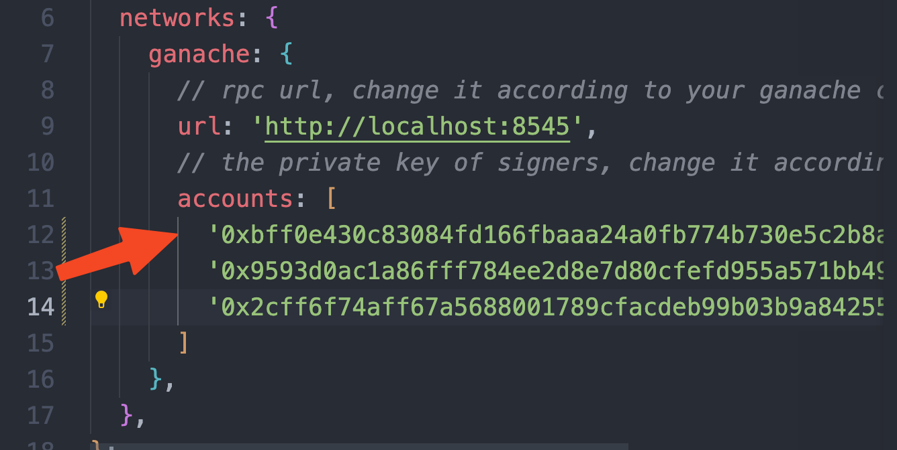

    然后运行如下的命令：

    ```bash
    $ npx hardhat run ./scripts/deploy.ts --network ganache
    ```

    获取到部署的两个合约地址：

    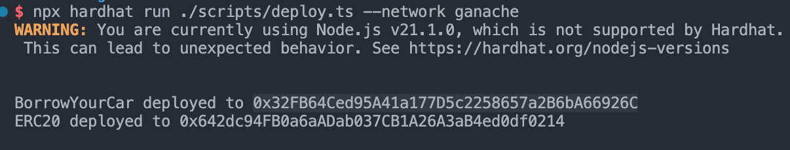

    在前端的`frontend/src/utils/contract-addresses.json`位置粘贴上这两个地址：

    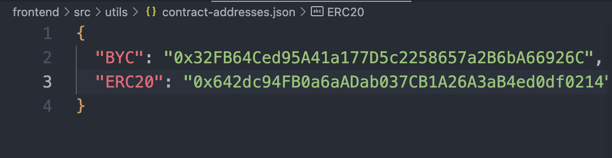

    在前端` frontend/src/pages/erc/index.tsx`第215行的approve函数粘贴上面的`BYC`地址：

    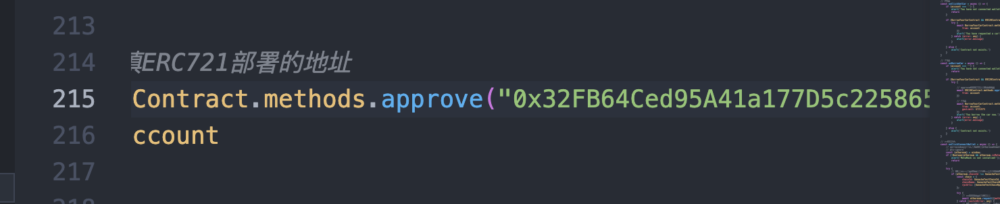

    最后记得把ABI复制到`frontend/src/utils/abis`。

5. 在 `./frontend` 中安装需要的依赖，运行如下的命令：
    ```bash
    $ npm install
    ```

6. 在 `./frontend` 中启动前端程序，运行如下的命令：
    ```bash
    $ npm start
    ```

## 功能实现分析

1. 分发ERC20 Token作为借车时消耗的代币。当A用户向B用户借车时，A将与借车时间相关的ERC20 Token转给B，然后区块链上的车的信息得到记录。
2. 通过区块链上某用户私钥，部署合约，得到两个合约部署的公钥。
3. 部署后，初始化ERC721合约，初始化ERC20的实例，初始化链上的车辆数、车辆数组等状态量，其他函数可以调用。
4. 领取车辆：用户向ERC721对应账户发送请求，智能合约中的mint被调用，创建车信息，用户付ETH。
5. 获取空闲车、用户车辆：用户支付ETH，前端调用智能合约ABI请求链中车的信息。
6. 借车：A用户向B用户借车，A用户不仅支付ETH，还要将一定数量的ERC20 Token转账给B用户。

## 项目运行截图

部署成功示例，用hash = 0的用户创建合约：

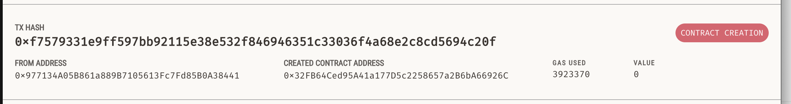

连接新用户：

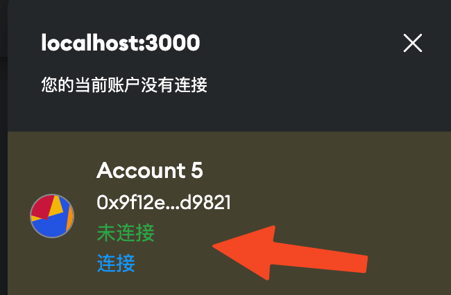

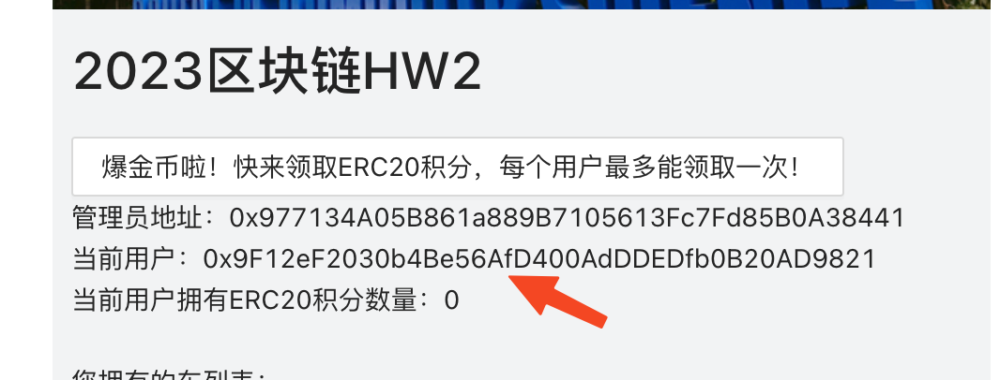

领取ERC20积分（点完按钮记得刷新）：

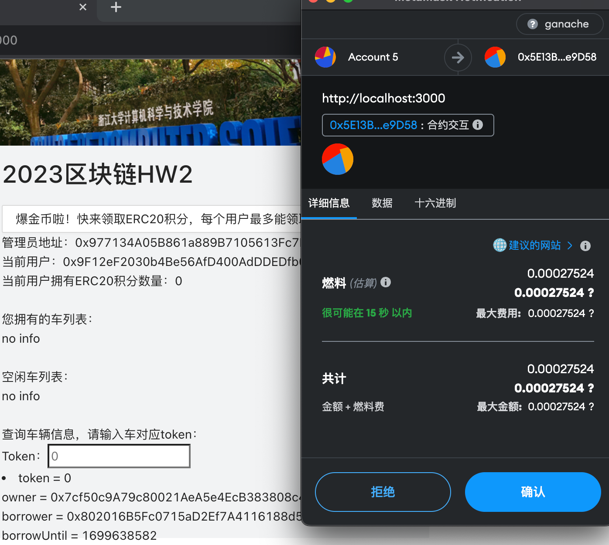

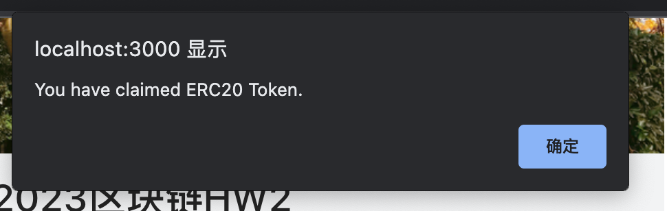

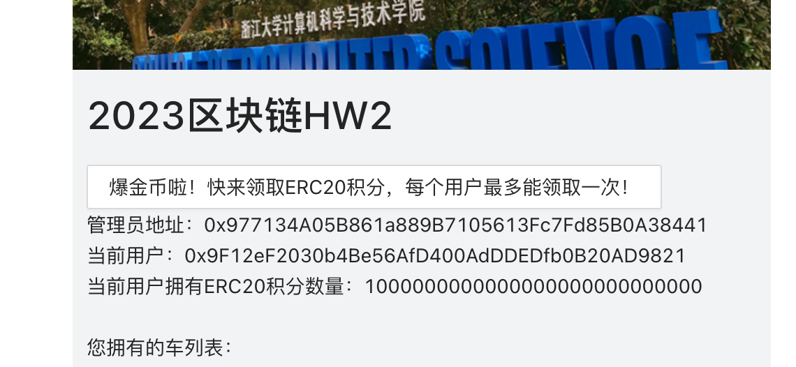

领取车辆+查看用户车辆：

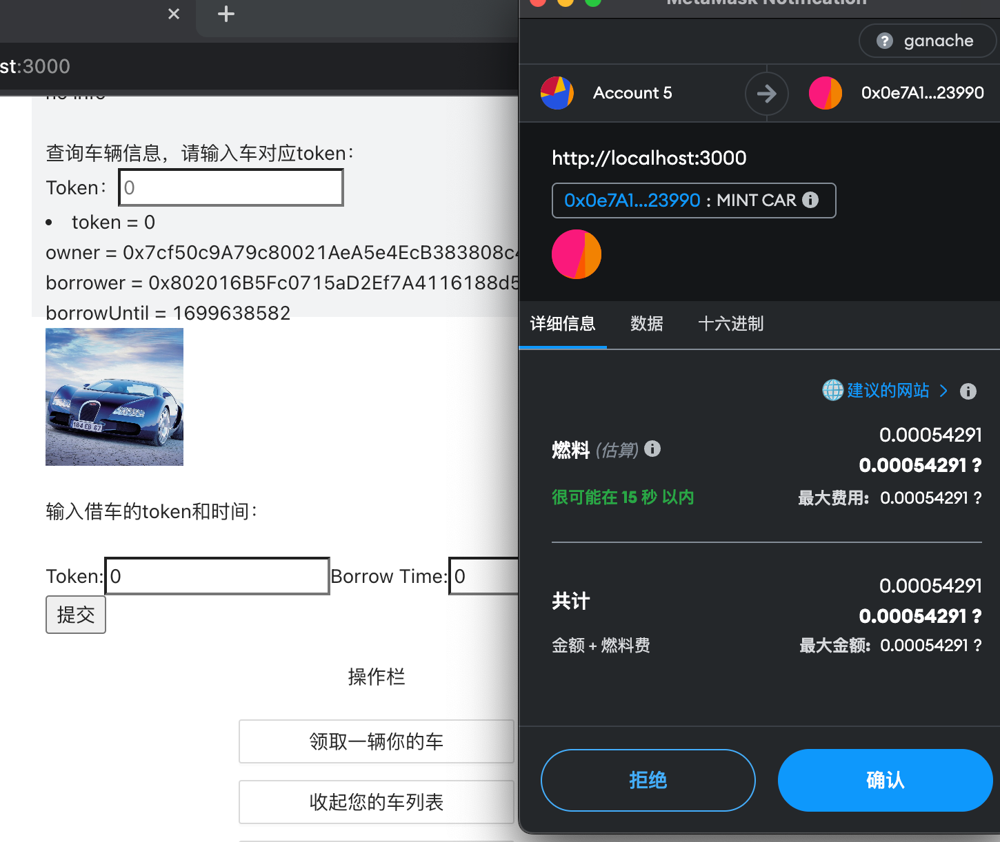

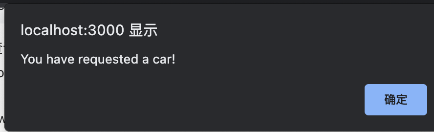

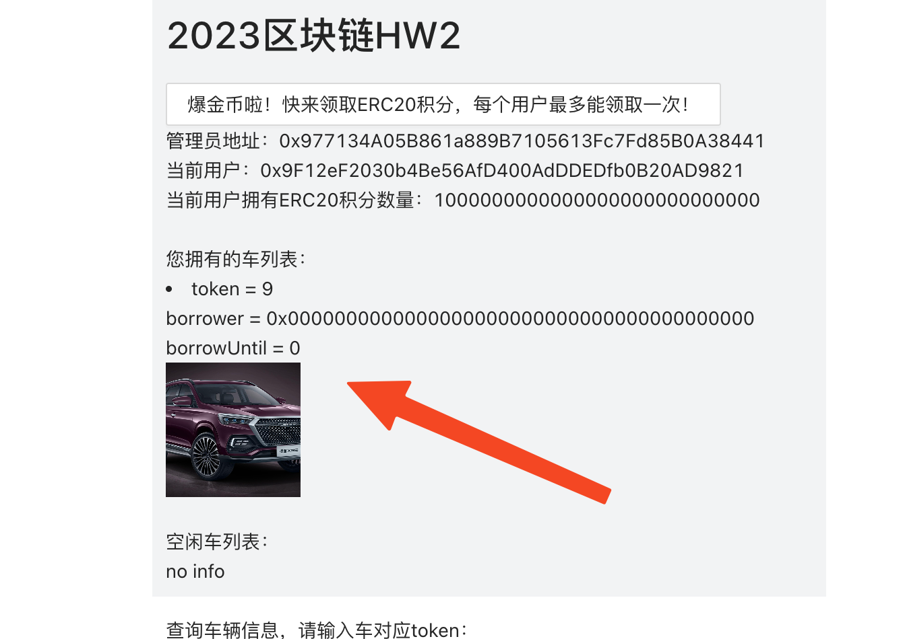

查看空闲车辆：

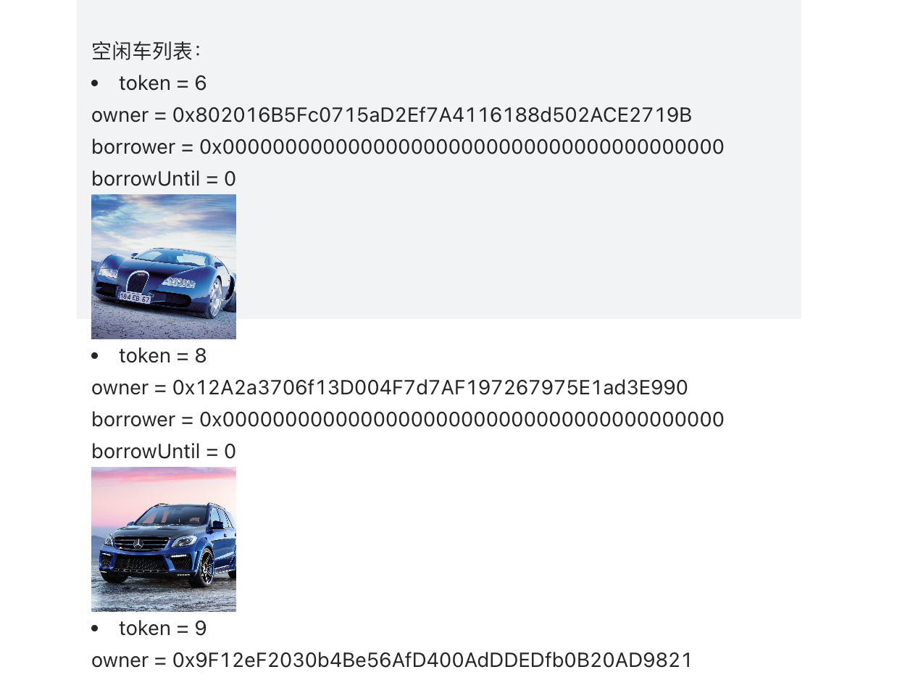

查询车，合法车token和不合法：

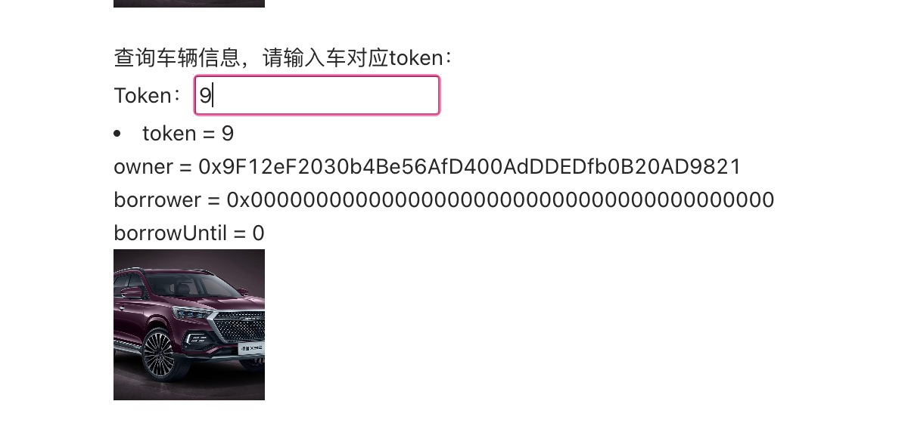

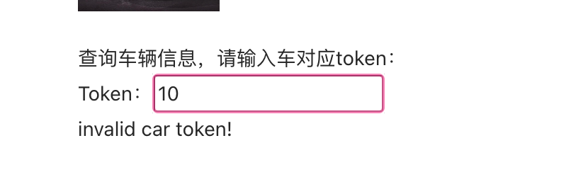

借车，发现车从空闲列表消失，两个人Token变化。

借车前，被借用户：

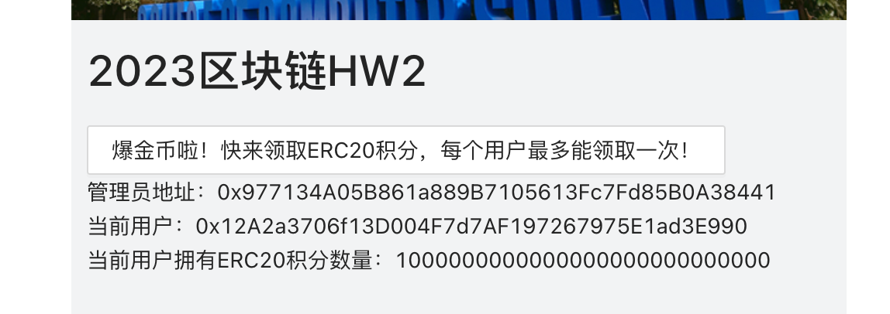

借车用户：

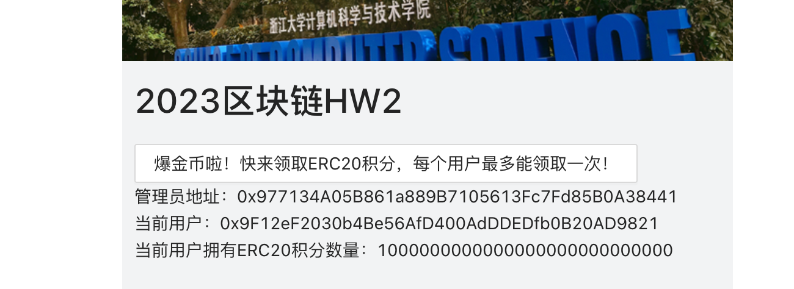

借车先approve：

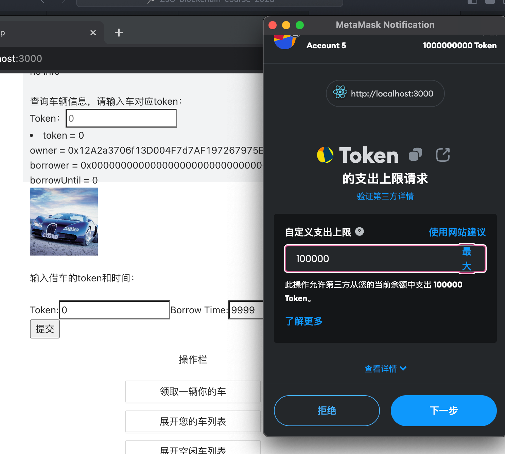

成功借车：

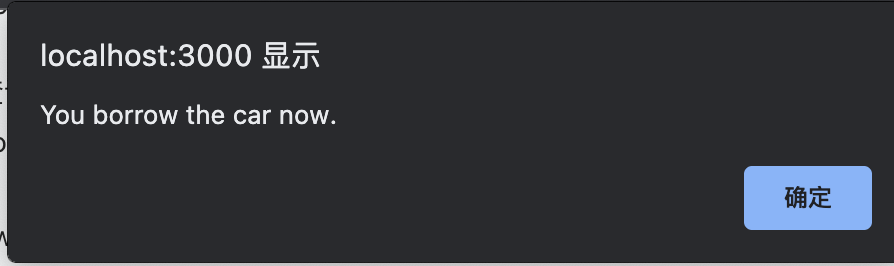

借车后，借车用户：

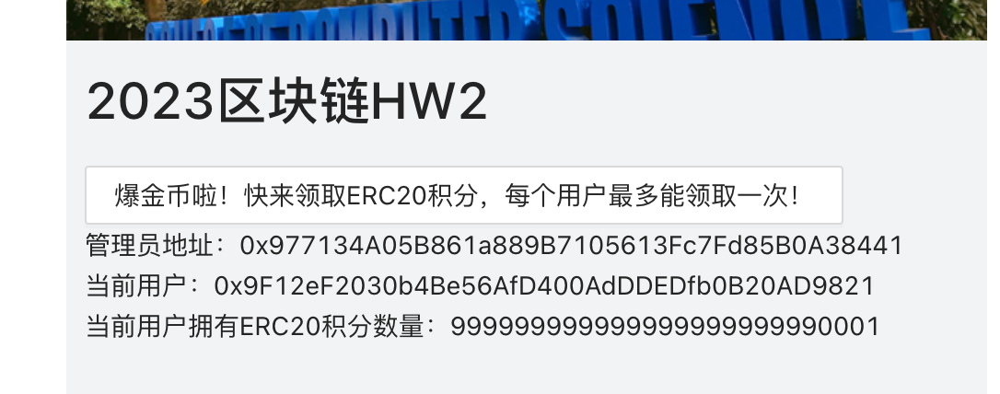

借车后，被借用户：

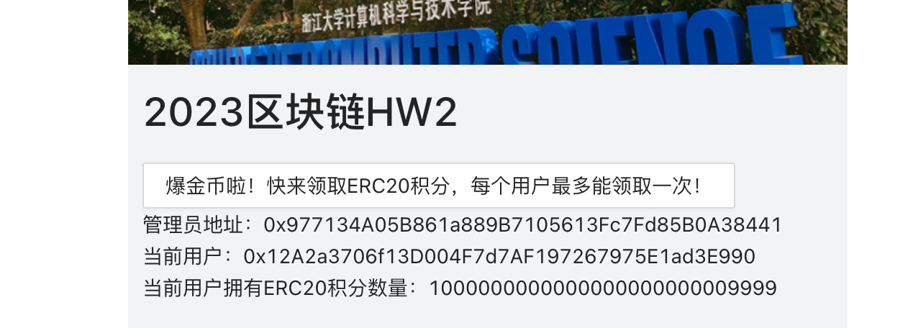

## 参考内容

- 课程的参考Demo见：[DEMOs](https://github.com/LBruyne/blockchain-course-demos)。

- ERC-4907 [参考实现](https://eips.ethereum.org/EIPS/eip-4907)
